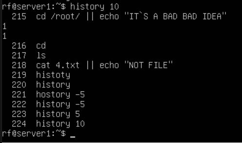
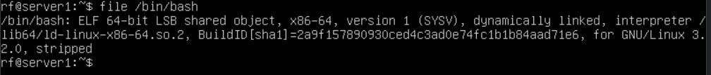
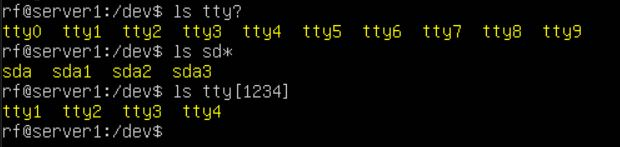

# Общие команды в командной строке.

В данном блоке описываются команды с пояснениями, которые я редко использую или не знал в моменте обучения.

- whoami - кто мы, что за пользователь.
- pwd - где я, указывает путь до каталога, где вы находитесь.
- clear - очищает экран.
- head -n - выведет первые n строк файла или содержимое каталога.
- tail -n  - выведет последние n строк файла или содержимое каталога.
- less - просмотр файлов или содержимое каталога, с возможностью листать вниз-вверх инфорамацию. С помощью / можно указать текст и выделится текс, который встречается в документе.
- more - тоже самое, что и less, только выводит информацию по странично. Только можно спускаться вниз, вверх нельзя.
- history - выводит команды, которые мы вводили. Если поставить любую n-цифру после команды, то выведется последние n команды

 

- file <name>- это команда, которая определяет тип файла по его содержимому, а не по расширению.

    

- ls <name>[reg] - вывод файлов, каталов начиная с <name>, а потом указанные символы.Также можно применить * или ?.

    

- touch <flag> <name> - создание файлов, а также изменение некоторых мета-данных, например даты и время создания файла.

    

