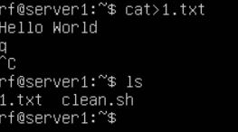
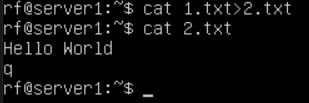
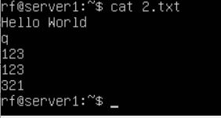
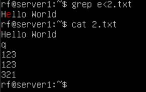
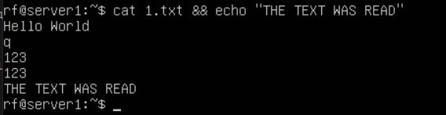
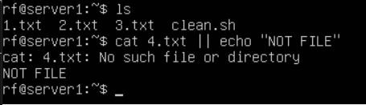

# Команды потока ввода-вывода данных

Команды для работы с файлами, записи, переадресация.

## CAT

`cat` **- (от concatenate) — это стандартная утилита в Linux/macOS/Unix для работы с текстовыми файлами.**
- `cat > <file>` - создание файла. Нам предлагает его заполнить данными. `CTRL+D` - выход.

   <file>">

- `cat <file1> > <file2>` - создание файла file2 и копирование с file1 в file2.

  > <file2>">

- `cat >> <file>` - добавление в файл новых данных.

 > <file>">

## GREP
`grep` **- (от global regular expression print) — утилита для поиска текста по шаблону (регулярному выражению) в файлах или потоке ввода.**

- `grep <reg> < <file>` - находит вхождение в файле и выводит ее.

  < <file>">

## && or || - аналогия if else.

- && (логическое И)- если истино, то выполнится действие,которое указали после &&

 

- || (логическое ИЛИ)- если лож, то выполнится действие,которое указали после ||

 

