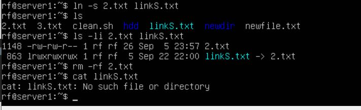

# Символические и жесткие ссылки

Ссылки в Linux - это инструмент, позволяющий указывать путь к файлам и каталогам (подобие ярляка в Windows). Существует два основных типов ссылок: жесткие и мягкие (символьная).
Мягкая ссылка (символическая ссылка) — это отдельный файл, содержащий путь к другому файлу или директории. Если мы удалим или переместим символьную ссылку, то она становистя "висячей", т.е. объект был перемещен или удален. Так же они могут указывать не только на файлы, но и на целые каталоги.
- ln -s - создание символической ссылки (мягкой). Как видно из примера у симвлоной ссылки другой inode. После удаления файла мы видем сообщение об ошибке, если мы пытаемся сделать что-то с ссылкой

    

